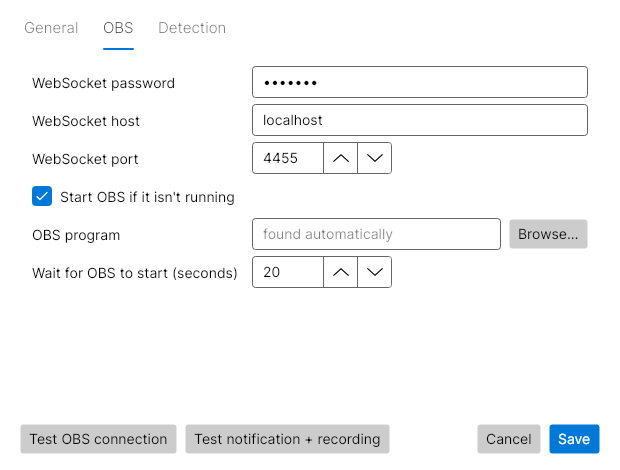

# Teams OBS Recorder (.NET 8)

A small background app for **Windows and Linux**. It watches for a Microsoft Teams
meeting or call and shows a notification with two buttons:

- **Record**: starts recording in OBS (launching OBS first if it isn't running).
- **Dismiss**: ignores this meeting.

A meeting or call is detected in two ways:

- a Teams window whose title matches `*meeting*`, or
- Teams using the microphone. This catches 1:1 and group calls, whose window is titled
  with the other person's name rather than "meeting".

When the meeting or call ends, the recording it started is stopped automatically
(you can turn that off in the config).

Each OS gets one self-contained executable. No .NET install is needed to run it.

## 1. Prepare OBS (once)

1. Install OBS Studio 28 or newer.
2. In OBS open **Tools > WebSocket Server Settings**, tick **Enable WebSocket server**,
   keep port `4455`, and copy the password (or untick authentication).
3. Set up your scene the way you want meetings recorded (e.g. Display Capture or
   Window Capture plus Desktop Audio and Mic/Aux).

## 2. Get the executable

Download the zip for your system from the repository's **Releases** page. GitHub Actions
builds them: a push to `main` with a new `<Version>` in `TeamsObsRecorder.csproj` publishes a
new release.

| OS | File |
|---|---|
| Windows 10 (1809+) / 11, x64 | `TeamsObsRecorder-win-x64.zip` |
| Linux x64 | `TeamsObsRecorder-linux-x64.zip` |

Put it somewhere permanent, for example `%LOCALAPPDATA%\TeamsOBSRecorder\` on Windows
or `~/.local/bin/` on Linux (`chmod +x` it there).

The Windows exe isn't code-signed, so SmartScreen may warn the first time.
Choose **More info > Run anyway**, or build it yourself (below).

**Linux extras**: the app reads windows with `wmctrl` and shows the prompt with
`notify-send` (libnotify 0.7.9+, e.g. Ubuntu 22.04+). If your `notify-send` can't show
buttons, install `zenity` and a small dialog is shown instead.

```bash
sudo apt install wmctrl libnotify-bin pulseaudio-utils   # Debian/Ubuntu; use dnf/pacman elsewhere
```

## 3. Settings

Start the app (double-click it). The first time, the **Settings** window opens, with General, OBS and Detection tabs. After that
the app sits in the system tray: click the tray icon, or start the app again, to reopen
Settings. The tray menu also has **Pause detection**, **Open log file** and **Exit**.



In Settings you can:

- turn **Start automatically when I sign in** on or off,
- enter the OBS WebSocket password and use **Test OBS connection**,
- use **Test notification + recording**: choosing Record makes a 5-second test clip in OBS,
- change how meetings and calls are detected,
- choose on the **Recordings** tab where recordings go and how they're named (see below),
- see on the **Status** tab what the app detects right now (Teams windows, apps using the
  microphone, apps playing sound). Open it during a call to check detection.

Saved changes apply right away; no restart needed.

On Linux the tray icon needs a desktop with tray support (KDE, Cinnamon, XFCE, or GNOME
with the AppIndicator extension). Without it, start the app again to open Settings.

### Recording names and folders

When a recording this app started stops, the app renames it and moves it, by default to:

```text
<folder>/<meeting name>/2026-10-07 14-30 <meeting name>.mkv
```

- **Save recordings in**: empty means the folder OBS already saves to.
- **Put each meeting in its own folder**: recurring meetings have the same title, so they end
  up in the same folder.
- **File name**: a template with `{meeting}`, `{date}` and `{time}`.
- The meeting name comes from the meeting window title. For 1:1 and group calls it comes from
  the call window (usually the other person's name), or "Teams call" if none is found.
- If OBS remuxes to .mp4 automatically, the .mp4 is moved too. A file with the same name gets
  " (2)" added instead of being overwritten.
- Recordings you start or stop yourself in OBS are left alone.

### The config file

Settings are stored in a JSON file, which you can also edit by hand:

- Windows: `%APPDATA%\TeamsOBSRecorder\config.json`
- Linux: `~/.config/teams-obs-recorder/config.json`

All settings:

| Key | Default | Meaning |
|---|---|---|
| `title_patterns` | `["*meeting*"]` | Window titles that count as a meeting (case-insensitive wildcards) |
| `exclude_title_patterns` | `[]` | Titles to ignore even if they match |
| `process_names` | Teams executables | Only windows from these processes count. Use `[]` to allow any app, e.g. Teams in a browser |
| `poll_interval_seconds` | `2` | How often windows are checked |
| `meeting_end_grace_seconds` | `10` | How long no meeting window must exist before the meeting counts as ended |
| `prompt_timeout_seconds` | `60` | No answer within this time counts as Dismiss |
| `stop_recording_when_meeting_ends` | `true` | Stop the recording this app started when the meeting ends |
| `detect_microphone_use` | `true` | Treat Teams using the microphone as a call (1:1 and group calls) |
| `microphone_apps` | `["*teams*"]` | Which apps count when using the microphone (or playing sound) |
| `require_sound_with_microphone` | `false` | Only count a call when Teams uses the mic **and** plays sound |
| `obs.host` / `obs.port` / `obs.password` | `localhost` / `4455` / empty | obs-websocket connection |
| `obs.launch_if_not_running` | `true` | Start OBS (minimised to tray) when Record is clicked and OBS is closed |
| `obs.executable` | auto | Path to OBS if it isn't in the default place |
| `obs.startup_wait_seconds` | `20` | How long to wait for a freshly started OBS to answer |
| `recordings.organize` | `true` | Rename and move recordings when they stop |
| `recordings.folder` | empty | Where recordings go (empty = OBS's folder) |
| `recordings.group_by_meeting` | `true` | One subfolder per meeting name |
| `recordings.file_name` | `{date} {time} {meeting}` | File name template |

`config.example.json` shows the full default file. A config from the Python version works as is.

## 4. Try it

The Settings window has test buttons. The same checks are available from a terminal
(Command Prompt / PowerShell on Windows):

```text
TeamsObsRecorder --settings       opens the Settings window
TeamsObsRecorder --headless       runs without a tray icon or windows
TeamsObsRecorder --test-obs       checks the OBS connection (starts OBS if needed)
TeamsObsRecorder --test-toast     shows the Record/Dismiss prompt once
TeamsObsRecorder --list-windows   lists open windows and apps using the mic, marking matches
TeamsObsRecorder                  runs with the tray icon
```

If nothing pops up during a meeting or call, run `--list-windows` while in it: it shows
the exact window titles, process names and the apps using the microphone, so you can
adjust `title_patterns`, `process_names` or `microphone_apps`. A log is written next to the config file (`teams-obs-recorder.log`).
Only one copy runs at a time; starting it again opens Settings instead.

## 5. Run at login

Tick **Start automatically when I sign in** in Settings, or from a terminal:

```text
TeamsObsRecorder --install-autostart     start at login
TeamsObsRecorder --uninstall-autostart   undo
```

Run it from the place you put the executable, since that path is what gets registered.
On Windows this adds a value under `HKCU\Software\Microsoft\Windows\CurrentVersion\Run`.
On Linux it creates `~/.config/autostart/teams-obs-recorder.desktop`.
The Windows build has no console window, so nothing appears on screen while it runs.

## Build from source

Needs the .NET 8 SDK. Both executables can be built from either OS.

```bash
dotnet test tests/TeamsObsRecorder.Tests

cd src/TeamsObsRecorder
dotnet publish -c Release -f net8.0-windows10.0.17763.0 -r win-x64 -o ../../publish/win-x64
dotnet publish -c Release -f net8.0 -r linux-x64 -o ../../publish/linux-x64
```

For ARM machines use `-r win-arm64` or `-r linux-arm64`. The project file makes every
`publish -r` a self-contained, compressed single file.

### Layout

| File | What it does |
|---|---|
| `Program.cs` | Command-line options, single-instance check, picks the platform pieces |
| `Gui/App.cs` | Tray icon and menu |
| `Gui/SettingsWindow.cs` | Settings window |
| `Gui/BackgroundService.cs` | Runs the watcher and reloads settings when they change |
| `MeetingWatcher.cs` | Title/process matching and the meeting session logic |
| `Obs.cs` | obs-websocket v5 client (handshake, auth, requests) and start/stop/launch |
| `Config.cs` | `config.json` loading with defaults |
| `Recordings.cs` | Meeting name guessing, file naming and moving finished recordings |
| `Autostart.cs` | Run-at-login registration |
| `Platform/WindowsWindowLister.cs` | Win32 `EnumWindows` |
| `Platform/WindowsToastPrompt.cs` | Windows toast with Record/Dismiss buttons |
| `Platform/LinuxWindowLister.cs` | `wmctrl -lp` |
| `Platform/LinuxPrompt.cs` | `notify-send` actions, or `zenity` |
| `Platform/WindowsMicrophoneMonitor.cs` | Apps using the mic / playing sound |
| `Platform/WindowsAudioSessions.cs` | Core Audio API: active audio streams per process and its parents |
| `Platform/LinuxMicrophoneMonitor.cs` | Apps using the mic, from `pactl list source-outputs` |

## How it works

- A meeting "session" starts when a matching Teams window appears or Teams starts using
  the microphone, and ends when neither has been seen for `meeting_end_grace_seconds`.
  On Windows the mic check combines the active audio streams per app (the same data as the
  Volume Mixer, including Teams helper processes such as WebView2) with
  `HKCU\Software\Microsoft\Windows\CurrentVersion\CapabilityAccessManager\ConsentStore\microphone`,
  the data that drives the mic icon in the taskbar. On Linux it uses `pactl`
  (PulseAudio or PipeWire). You get one prompt per meeting, even if
  Teams opens a compact or pop-out window or the title changes.
- If OBS was already recording when you clicked Record, the app leaves that recording
  alone and won't stop it at the end.

## Known limits

- **Linux Wayland**: `wmctrl` only sees X11/XWayland windows. `teams-for-linux` and
  browsers run under XWayland by default, so it usually works; apps forced into native
  Wayland mode are invisible to it.
- **Teams in a browser**: only the active tab's title is visible, and it must contain
  "meeting"; set `process_names` to `[]` (or add your browser) to allow it.
- **Windows notifications**: Focus Assist / Do Not Disturb hides the toast.
